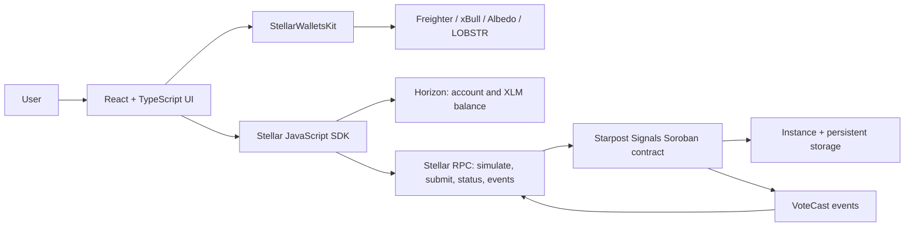

# Starpost Signals — Stellar Level 2 Project Plan

## 1. Project outcome

Build and submit **Starpost Signals**, a one-question live poll on Stellar Testnet. A user connects one of several supported wallets, selects one option, signs a Soroban contract call, follows the transaction from simulation through confirmation, and sees totals and contract events update without refreshing the page.

The project is intentionally narrow: one wallet address can cast one permanent vote. That keeps the contract understandable while demonstrating every Level 2 requirement clearly.

## 2. Rubric traceability

| Level 2 requirement | Planned implementation | Submission evidence |
| --- | --- | --- |
| StellarWalletsKit | Wallet picker with Freighter, xBull, Albedo, and LOBSTR modules | Screenshot of the open picker and source link |
| Three handled error types | Wallet unavailable, request rejected, and insufficient Testnet XLM; also handle wrong network, duplicate vote, and RPC failure | Error-state test checklist and source links |
| Contract deployed on Testnet | Rust/Soroban poll contract built and deployed with Stellar CLI | Contract ID, explorer link, and deployment transaction hash |
| Contract called from frontend | `get_results` read call and wallet-authorized `vote` write call through `@stellar/stellar-sdk` | Successful live vote plus explorer transaction |
| Read and write contract data | Read poll totals; write one vote per authenticated address | Contract tests and visible count change |
| Real-time state synchronization | Poll `getEvents` every five seconds with a cursor, deduplicate event IDs, update the activity feed, then refresh results | Two-browser/manual test and event transaction link |
| Transaction status visible | `idle → simulating → awaiting_signature → pending → success/failed` | Screenshot or short recording of status UI |
| Minimum 2+ meaningful commits | Use the five commit milestones below; do not squash them before submission | Public Git history |
| Public repository and README | Public GitHub repository with setup, architecture, proof links, and screenshots | Final repository URL |
| Live demo | Deploy the Vite app to Vercel | Production URL in README |

## 3. User journeys

### Happy path

1. The visitor opens the app and sees current on-chain results without connecting a wallet.
2. They open the StellarWalletsKit picker and choose a supported wallet.
3. The app verifies that the wallet is on Testnet and displays the shortened address and XLM balance.
4. The user selects one poll option and clicks **Cast this signal**.
5. The UI shows simulation, wallet approval, pending submission, and confirmed success states.
6. The app shows the transaction hash with a Stellar Explorer link.
7. The results and contract-event feed update automatically for all open clients.

### Recovery paths

- An unavailable wallet produces installation/unlock guidance and allows reopening the picker.
- A rejected connection or signature confirms that nothing was submitted and allows retrying.
- A balance below the app's safe Testnet threshold blocks signing and points the user to Friendbot funding.
- A Mainnet wallet is disconnected and prompted to switch to Testnet.
- A second vote from the same address explains the one-address/one-vote contract rule.
- A simulation, RPC, or submission failure ends in `failed`, never in a false success state.

## 4. Technical architecture

### Frontend

- React, TypeScript, and Vite.
- `src/lib/wallet.ts`: StellarWalletsKit setup, connection, network validation, signing, and disconnect.
- `src/lib/stellar.ts`: read calls, balance checks, transaction creation/simulation/submission/polling, event retrieval, and friendly error mapping.
- `src/types.ts`: explicit poll, event, error, and transaction-state types.
- `src/App.tsx`: wallet, poll, transaction, proof, and live-event UI.
- `src/config.ts`: Testnet passphrase, RPC/Horizon endpoints, explorer base URL, and contract ID from environment variables.

### Smart contract

| Function | Auth | Behavior |
| --- | --- | --- |
| `initialize(admin, question, options)` | Admin | Store a two-to-four-option poll exactly once |
| `vote(voter, option)` | Voter | Reject invalid or duplicate votes, update counts, store the user's selection, and publish an event |
| `get_results()` | None | Return the question, options, counts, and total |
| `get_vote(voter)` | None | Return the option previously selected by an address |

Storage design:

- Instance storage: poll configuration, option counts, and total votes.
- Persistent storage: one voter record per address.
- TTL extension: refresh instance and voter data during normal reads/writes so demo state does not expire unexpectedly.
- Contract errors: already initialized, not initialized, invalid option list, invalid option, and already voted.
- `VoteCast` event: voter and option as topics; option total and overall total as event data.

## 5. Transaction and synchronization design

### Write transaction state machine

| State | Trigger | UI behavior |
| --- | --- | --- |
| `idle` | Initial/retry | Vote button is ready |
| `simulating` | Vote begins | Disable duplicate clicks; prepare the Soroban transaction |
| `awaiting_signature` | Prepared transaction is ready | Tell the user to approve in the wallet |
| `pending` | Signed transaction is submitted | Show confirmation progress and retain the hash when available |
| `success` | RPC reports success | Link the hash, refresh result/balance, and lock repeat voting |
| `failed` | Any terminal error | Show a mapped recovery message and allow a safe retry |

Only RPC-confirmed success counts as success. A wallet signature alone is not confirmation.

### Event synchronization

1. On page load, request recent contract events and remember the returned cursor.
2. Poll Stellar RPC every five seconds using the cursor.
3. Accept only this contract's `vote_cast` events.
4. Decode the voter, option, per-option total, overall total, transaction hash, ledger, and close time.
5. Deduplicate by event ID and keep a bounded newest-first feed.
6. Refresh `get_results` whenever new vote events arrive.
7. If one polling call fails, preserve the current UI and retry on the next interval.

## 6. Work plan and acceptance gates

### Phase 0 — Repository and environment

- Put Level 2 in its own public repository or intentionally track `lvl2/` in the current repository.
- Add `.gitignore`, `.env.example`, license, Node/Rust prerequisites, and Testnet-only warning.
- Pin package versions before final submission; avoid leaving production dependencies on `latest`.
- Never commit seed phrases, secret keys, `.stellar`, `.soroban`, or local environment files.

Gate: clean install succeeds, no secrets are tracked, and GitHub visibility is public.

### Phase 1 — Contract and tests

- Implement the contract interface and storage/event design above.
- Test initialization, empty reads, successful voting/event emission, duplicate vote rejection, invalid option rejection, and invalid initialization.
- Run `cargo test` and `stellar contract build`.

Gate: all contract tests pass and the optimized Wasm builds.

### Phase 2 — Testnet deployment

- Create/fund a dedicated Stellar CLI Testnet identity.
- Deploy the Wasm with `stellar contract deploy --network testnet`.
- Initialize the poll through the CLI.
- Record the contract ID, deployment hash, initialization hash, network, CLI version, and UTC deployment date.
- Verify the contract and initialization transaction in Stellar Explorer before wiring the frontend.

Gate: `get_results` returns the initialized poll from public Testnet RPC.

### Phase 3 — Multi-wallet frontend

- Configure StellarWalletsKit for Freighter, xBull, Albedo, and LOBSTR.
- Implement connect, selected-wallet display, address display, Testnet verification, balance read, and disconnect.
- Keep all signing inside the wallet; the app must never request a secret key.

Gate: at least two wallet paths are manually exercised and all four options are visible in the picker.

### Phase 4 — Contract reads/writes and status UI

- Simulate `get_results` for a read-only initial page load.
- Build `vote`, prepare it with RPC simulation, request wallet signature, submit it, and poll its final status.
- Show every transaction state and the final hash/explorer link.
- Map the six user-facing error classes described above.

Gate: one real Testnet vote changes contract state and its hash is verifiable in Explorer.

### Phase 5 — Live events and UX polish

- Implement cursor-based event polling and result refresh.
- Add a bounded activity feed, responsive layout, keyboard focus states, ARIA live regions, loading/empty states, and safe disabled-button rules.
- Test synchronization with two browser windows or two wallets.

Gate: a vote in window A appears in window B without a page reload.

### Phase 6 — Release and evidence

- Run the complete validation matrix below.
- Deploy to Vercel and smoke-test the production origin with a Testnet wallet.
- Capture a wallet-options screenshot and a confirmed-transaction screenshot.
- Finish the README, verify every link in a signed-out browser, and check Git history.

Gate: every item in the final checklist has a working proof artifact.

## 7. Validation matrix

| Area | Test | Expected result |
| --- | --- | --- |
| Contract | `cargo test` | All unit tests pass |
| Contract | Build optimized Wasm | Build succeeds without secrets or local paths in the repo |
| Frontend | `npm ci` | Reproducible clean install succeeds |
| Frontend | `npm run lint` | TypeScript checks pass |
| Frontend | `npm run build` | Production bundle succeeds |
| Wallet | Open picker | Four wallet choices are visible |
| Wallet | Reject connect/sign request | `USER_REJECTED`; no success or hash is shown |
| Wallet | Use unavailable/locked wallet | `WALLET_UNAVAILABLE` with recovery guidance |
| Network | Connect on Mainnet | `WRONG_NETWORK`; user is told to switch to Testnet |
| Balance | Use underfunded account | `INSUFFICIENT_BALANCE`; signing is not requested |
| Contract | Cast first vote | Transaction reaches success and totals increment once |
| Contract | Cast second vote from same address | `ALREADY_VOTED`; totals do not change |
| RPC | Force invalid/unreachable RPC URL locally | Failed state appears; no false success |
| Events | Vote from a second client | Activity and totals update in the first client within one polling interval |
| Deployment | Reload a deep/production URL | App loads and uses the Testnet contract |
| Documentation | Follow README from a clean clone | Setup works without undocumented steps |

Current local baseline on 2026-08-10: the frontend production build and TypeScript check pass; all five Rust contract tests pass. There is a non-blocking Vite warning about a JavaScript chunk larger than 500 kB.

## 8. Meaningful commit plan

Keep at least these commits separate and descriptive:

1. `feat(contract): add authenticated poll storage and vote events`
2. `test(contract): cover initialization voting and rejection cases`
3. `feat(wallets): integrate multi-wallet Testnet connection`
4. `feat(app): add contract calls transaction status and event sync`
5. `docs(release): add deployment proof screenshots and setup guide`

Do not create fake padding commits, and do not squash below two meaningful commits before the review. The current `lvl2/` directory is untracked in the parent repository, so Git history is a release blocker until the project is committed to the intended public repository.

## 9. README specification

The final README should contain, in this order:

1. Project name and one-sentence purpose.
2. Live demo link and Testnet warning.
3. Screenshot of the live app.
4. Requirement-to-implementation table.
5. Wallet-options screenshot.
6. Deployed contract ID with explorer link.
7. Deployment transaction hash, initialization hash, and one successful frontend `vote` hash.
8. Feature list and handled-error table.
9. Local setup: prerequisites, clone, `npm ci`, environment, and `npm run dev`.
10. Contract test/build/deploy commands.
11. Contract API, storage, event, transaction-flow, and real-time synchronization notes.
12. Tech stack, security notes, license, and known limitations.

## 10. Risks and controls

| Risk | Control |
| --- | --- |
| Wallet APIs produce inconsistent error text | Normalize errors in one `friendlyError` function and manually test representative wallets |
| User sees success before finality | Only set success after RPC returns a successful final status |
| Event polling duplicates activity | Persist the RPC cursor in memory and deduplicate by event ID |
| RPC event delay creates stale totals | Refresh state after successful writes and again after newly observed events |
| Contract state expires | Extend storage TTL and re-check the deployed contract immediately before submission |
| Testnet data or proof becomes unavailable | Re-run a verified vote near the deadline and update explorer links/screenshots |
| Public bundle contains secrets | Use public contract/RPC configuration only; inspect tracked files and built assets |
| Reviewer cannot reproduce setup | Validate the README from a clean clone and pin dependency versions |

## 11. Suggested seven-day schedule

| Day | Deliverable |
| --- | --- |
| 1 | Repository setup, wireframe, contract interface, and acceptance checklist |
| 2 | Contract implementation and unit tests |
| 3 | Testnet deploy/initialize and proof capture |
| 4 | Multi-wallet connect, network check, balance, and disconnect |
| 5 | Contract reads/writes, transaction states, and error mapping |
| 6 | Event synchronization, two-client test, accessibility, and responsive polish |
| 7 | Vercel release, clean-clone QA, screenshots, README, and submission audit |

## 12. Final submission checklist

- [ ] Repository is public and opens while signed out.
- [ ] Git history contains at least two meaningful commits.
- [ ] No keys, seed phrases, or private configuration are tracked.
- [ ] Four wallet options are visible and documented.
- [ ] Wallet unavailable, rejected request, and insufficient balance are demonstrably handled.
- [ ] Contract ID resolves on Stellar Testnet Explorer.
- [ ] Frontend reads contract state and submits a signed write call.
- [ ] A frontend contract-call transaction hash is successful and linked.
- [ ] Pending, success, and failure states are visible.
- [ ] A second client receives vote events and refreshes without reload.
- [ ] `cargo test`, `npm run lint`, and `npm run build` pass.
- [ ] README includes setup, screenshots, contract address, call hash, and optional live demo.
- [ ] Production deployment is smoke-tested on desktop and mobile widths.
- [ ] Final GitHub repository link is submitted before the monthly deadline.

## 13. Definition of done

The project is done only when a reviewer can open the public app, see multiple wallet options, connect a Testnet wallet, cast a contract-backed vote, follow its pending-to-success lifecycle, open the confirmed transaction in Explorer, and observe the same vote appear in another open client without reloading—while the public repository independently proves the contract, tests, deployment, documentation, and meaningful development history.
