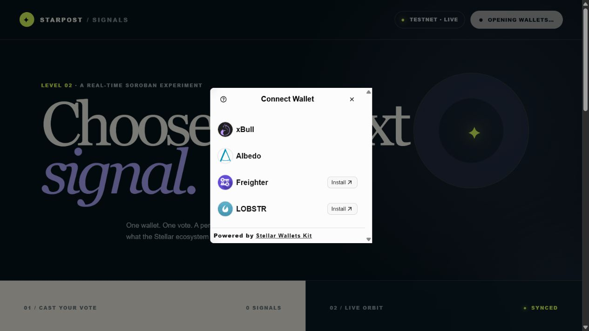

# Starpost Signals

Starpost Signals is a real-time, multi-wallet poll built on Stellar Testnet. Connect with Freighter, xBull, Albedo, or LOBSTR, choose what the Stellar ecosystem should build next, and cast one permanent on-chain vote through a Soroban smart contract.

**Live app:** [starpost-signals.vercel.app](https://starpost-signals.vercel.app)

**Network:** Stellar Testnet  
**Contract:** [`CBHWJQ6Q4FAKCTC5IOS5YJDB2AOP5EF4SE6ODOLACCZZ2B3GV34J3YIP`](https://stellar.expert/explorer/testnet/contract/CBHWJQ6Q4FAKCTC5IOS5YJDB2AOP5EF4SE6ODOLACCZZ2B3GV34J3YIP)


## Level 2 requirements

| Requirement | Implementation |
| --- | --- |
| Multi-wallet integration | StellarWalletsKit with Freighter, xBull, Albedo, and LOBSTR |
| Three error types | Wallet unavailable, request rejected, and insufficient XLM; wrong network, duplicate vote, and RPC errors are also handled |
| Contract deployed on Testnet | The deployed contract address and explorer link are above |
| Contract called from frontend | `get_results` is simulated for reads; `vote` is built, simulated, wallet-signed, submitted, and polled from the React client |
| Read and write contract data | Results are read from instance storage; votes update counts and persistent per-voter storage |
| Real-time synchronization | Contract events are polled every five seconds, deduplicated by event ID, displayed in the activity feed, and trigger result refreshes |
| Transaction status | Simulating, awaiting signature, pending, success, and failure are visible in the UI |
| Meaningful commits | Contract/tests, frontend/integration, and release evidence are separate commits |
| Vercel deployment | Production build is deployed at the live app link above |

## Wallet options

The built-in StellarWalletsKit picker reports whether each wallet is available and links to installation when needed.



## Testnet proof

- Contract deploy transaction: [`facdbc788ee9d4d5e035df76641b15355613e2e9c82b74327186ba54898440c5`](https://stellar.expert/explorer/testnet/tx/facdbc788ee9d4d5e035df76641b15355613e2e9c82b74327186ba54898440c5)
- Contract initialization call: [`6cd54416243f0cfd8afaadc261390bf1c5b0fd77af02b833aa8822adc42eff00`](https://stellar.expert/explorer/testnet/tx/6cd54416243f0cfd8afaadc261390bf1c5b0fd77af02b833aa8822adc42eff00)
- Verified `vote` call and emitted `VoteCast` event: [`b48752993b42bee828c55b8d8c4720f4e8b5ee62ee08083bcc2151ffffb259c3`](https://stellar.expert/explorer/testnet/tx/b48752993b42bee828c55b8d8c4720f4e8b5ee62ee08083bcc2151ffffb259c3)

The verification vote selected `Climate`, returned `{ option: 2, option_total: 1, total: 1 }`, and is visible in the app's live contract-event feed.

## Features

- Four-wallet Testnet connection and explicit disconnect
- Live XLM balance display for the connected account
- One on-chain vote per Stellar address
- Current vote counts, percentages, and an animated live orbit
- Contract-event activity feed with explorer links
- Full transaction lifecycle feedback
- Friendly recovery instructions for common wallet and transaction failures
- Responsive, keyboard-focusable interface

## Error handling

| Error | User-facing behavior |
| --- | --- |
| Wallet not installed or unavailable | Explains how to install/unlock a supported wallet and reopen the picker |
| User rejects or closes a request | Confirms nothing was submitted and lets the user safely retry |
| Insufficient Testnet XLM | Requires at least 1.5 XLM to leave room for reserve and Soroban fees |
| Wrong network | Disconnects and asks the user to switch to Stellar Testnet |
| Already voted | Explains the contract's one-address/one-vote rule |
| RPC or submission failure | Shows a failed state without claiming the transaction succeeded |

## Run locally

### Prerequisites

- Node.js 20 or newer
- npm
- One supported Stellar wallet configured for Testnet
- Rust and Stellar CLI only if you want to build or test the contract

### Frontend

```bash
git clone https://github.com/EkinOnat/starpost-signals.git
cd starpost-signals
npm ci
cp .env.example .env
npm run dev
```

Open the local URL printed by Vite. The checked-in defaults already point to the deployed Testnet contract, so copying `.env.example` is optional.

On Windows, if an optional Trezor dependency's Unix-only setup script fails, use `npm ci --ignore-scripts`. The four supported browser-wallet modules and production build do not depend on that script.

### Environment variables

| Variable | Default |
| --- | --- |
| `VITE_CONTRACT_ID` | Deployed Starpost Signals contract |
| `VITE_STELLAR_RPC_URL` | `https://soroban-testnet.stellar.org` |
| `VITE_HORIZON_URL` | `https://horizon-testnet.stellar.org` |

### Contract tests and build

```bash
cargo test
stellar contract build
```

To verify recent Testnet events through the same Stellar SDK used by the app:

```bash
node scripts/verify-events.mjs
```

## Contract interface

The Rust contract lives in `contracts/signals` and exposes:

- `initialize(admin, question, options)` — configures a poll with two to four options
- `vote(voter, option)` — authenticates the voter, rejects duplicate votes, updates counts, and publishes `VoteCast`
- `get_results()` — returns the question, options, counts, and total
- `get_vote(voter)` — returns the option previously selected by an address

Poll configuration and aggregate counts use instance storage. Voter records use persistent storage, and both storage classes extend their TTL during normal use.

## Transaction flow

```text
Select option
    ↓
Check Testnet XLM balance
    ↓
Build + simulate Soroban vote call
    ↓
Request wallet signature
    ↓
Submit to Stellar RPC and show PENDING
    ↓
Poll transaction → SUCCESS / FAILED
    ↓
Refresh contract state + ingest VoteCast event
```

## Tech stack

- React 19, TypeScript, and Vite
- `@creit.tech/stellar-wallets-kit`
- `@stellar/stellar-sdk`
- Rust with Soroban SDK 27
- Stellar Horizon and RPC Testnet endpoints
- Vercel

## Security and network notes

This is a Testnet application. Do not send real XLM. No secret key is stored in the repository or frontend; all user authorization happens inside the selected wallet. The deployer identity remains local to the developer machine.
