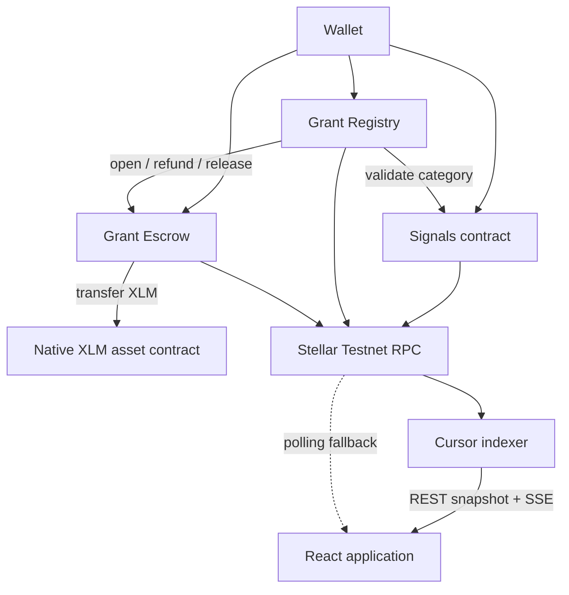
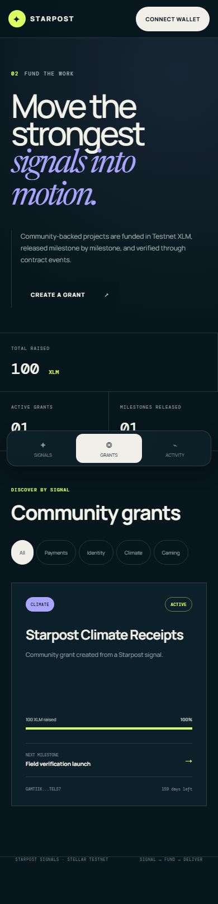

# Starpost Signals

**Signal what matters. Fund the work. Verify delivery on-chain.**

Starpost Signals is a production-style community coordination dApp on Stellar Testnet. The original permanent Signals poll remains live, and its four categories now lead into contributor-funded grants with escrowed XLM, milestone voting, releases, refunds, contract events, and real-time browser synchronization.

**Live app:** [starpost-signals.vercel.app](https://starpost-signals.vercel.app)

**Network:** Stellar Testnet

**Existing Signals contract:** [`CBHWJQ6Q4FAKCTC5IOS5YJDB2AOP5EF4SE6ODOLACCZZ2B3GV34J3YIP`](https://stellar.expert/explorer/testnet/contract/CBHWJQ6Q4FAKCTC5IOS5YJDB2AOP5EF4SE6ODOLACCZZ2B3GV34J3YIP)

**Level 3 Registry:** [`CCLUIBA3E7CILJOQYPYLV46W67U5HHR5PVQP4UEC6KTCYHWGZ5OFICHQ`](https://stellar.expert/explorer/testnet/contract/CCLUIBA3E7CILJOQYPYLV46W67U5HHR5PVQP4UEC6KTCYHWGZ5OFICHQ)

**Level 3 Escrow:** [`CADLWMML7RAV2INFHOYA3QNGELSORVXV7LORDBYMJJMLXTVZHGT5NRLK`](https://stellar.expert/explorer/testnet/contract/CADLWMML7RAV2INFHOYA3QNGELSORVXV7LORDBYMJJMLXTVZHGT5NRLK)


## Product flow

1. **Signal** — connect Freighter, xBull, Albedo, or LOBSTR and cast one permanent category vote.
2. **Fund** — create or discover a category grant and contribute Testnet XLM into its Escrow vault.
3. **Deliver** — contributors vote with contribution-weighted power; approved milestones release the exact scheduled XLM amount.
4. **Verify** — unified events, RPC-confirmed transaction states, and Stellar Expert links expose the lifecycle end to end.

## Level 1, 2, and 3 checklist

### Level 1

- [x] Stellar Testnet account and XLM interaction
- [x] Wallet connection and balance display
- [x] Public deployment and evidence

### Level 2

- [x] Four-wallet StellarWalletsKit picker
- [x] Deployed Signals contract with read/write calls
- [x] One permanent vote per account
- [x] `VoteCast` activity synchronization
- [x] Wallet, network, balance, duplicate-vote, rejection, and RPC errors
- [x] Confirmed transaction state and Explorer proof

### Level 3 implementation

- [x] Additive Registry and Escrow contracts; original Signals contract untouched
- [x] Registry-to-Signals and Registry-to-Escrow calls
- [x] Escrow-to-native-XLM asset transfers
- [x] Exact-goal funding, weighted voting, milestone release, cancellation, and refunds
- [x] Responsive Signals, Grants, and Activity views
- [x] Shared `validating -> simulating -> awaiting_signature -> submitted -> pending -> success/failed` lifecycle
- [x] Persistent cursor indexer, event deduplication, snapshots, SSE, retry, and RPC fallback
- [x] 40 Rust contract tests, 16 frontend tests, 10 indexer tests, and 3 E2E flows
- [x] Independent CI jobs, protected deployment workflow, release artifacts, and Dependabot
- [x] Threat model, operations guide, deployment manifest, and reproducible WASM hashes
- [x] Registry and Escrow Testnet deployment and nested-call proof hash
- [x] Production frontend redeployment and final mobile screenshot
- [ ] Public indexer deployment
- [ ] Green hosted CI screenshot and public demo video

Items that need deployed credentials or hosted-service access stay unchecked until their public evidence exists.

## Requirement matrix

| Requirement | Implementation |
| --- | --- |
| Preserve live Level 2 poll | Existing contract ID and Signals read/write path remain unchanged |
| Signals categories drive grants | Registry reads `get_results` and validates the category index |
| Two to five exact milestones | Registry rejects non-positive amounts and totals unequal to the goal |
| Escrowed XLM | Escrow calls the Testnet native XLM Stellar Asset Contract |
| Exact funding cap | Contributions fail when the new total would exceed the goal |
| Funding finalization | Exact goal activates; an underfunded expired round fails and becomes refundable |
| Weighted contributor voting | Escrow contribution balance is the Registry voting weight |
| Approval and quorum | Checked basis-point calculations guard every milestone release |
| Refunds | Failed/cancelled grants enable one claim per contributor |
| Real-time activity | Persistent indexer snapshots plus SSE, heartbeat, dedupe, retry, and direct RPC fallback |
| Transaction correctness | Success appears only after RPC reports `SUCCESS`; hash persists through timeout/failure |
| Mobile/accessibility | 320/390/768/desktop layouts, 44px targets, labels, focus states, reduced motion |
| Production safeguards | Validated configuration, CORS allowlist, rate limit, headers, structured logs, graceful shutdown |

## Architecture



Detailed design: [Level 3 architecture](docs/LEVEL3_ARCHITECTURE.md) · [Threat model](docs/THREAT_MODEL.md) · [Operations](docs/OPERATIONS.md)

## Contracts

### Signals (preserved Level 2)

- `initialize(admin, question, options)`
- `vote(voter, option)`
- `get_results()`
- `get_vote(voter)`

### Grant Registry

- `initialize(admin, signals, escrow)`
- `create_grant(creator, category, title, asset, goal, deadline, milestones, approval_bps, quorum_bps)`
- `finalize_funding(grant_id)`
- `vote_milestone(grant_id, voter, approve)`
- `finalize_milestone(grant_id)`
- `cancel_grant(grant_id)`
- `set_paused(paused)`
- `get_grant(grant_id)`, `get_milestones(grant_id)`, `has_voted(...)`

### Grant Escrow

- `initialize(admin, registry)`
- `open_grant(grant_id, creator, asset, goal, deadline)`
- `contribute(grant_id, contributor, amount)`
- `release(grant_id, milestone, amount)`
- `set_refundable(grant_id)`
- `claim_refund(grant_id, contributor)`
- `set_paused(paused)`
- `get_vault(grant_id)`, `total(grant_id)`, `contribution(...)`

### Events

`VoteCast`, `GrantCreated`, `VaultOpened`, `ContributionMade`, `FundingFinalized`, `MilestoneVoteCast`, `MilestoneApproved`, `FundsReleased`, `RefundEnabled`, `RefundClaimed`, and `GrantCancelled` feed the unified activity model.

## Reproducible artifacts

| Contract | Optimized WASM SHA-256 |
| --- | --- |
| Registry | `eac1ff7e0fb4201f070f0a90b64ef40dfec8dc403cae26b30555a883b5971c81` |
| Escrow | `e83be6d9f39addda57fb187f62a239f8acdb2f2e3e48cc862722e567a6674aa1` |

Addresses, artifact hashes, and every proof transaction live in [`deployments/testnet.json`](deployments/testnet.json).

## Transaction and error behavior

All Signals and Grants mutations use one state machine:

```text
idle -> validating -> simulating -> awaiting_signature
     -> submitted -> pending -> success
                             `-> failed
```

The UI handles wallet availability/lock/rejection, wrong network, insufficient spendable XLM, RPC/simulation/submission errors, pending timeouts, invalid schedules/deadlines, funding state, goal cap, no voting power, duplicate votes, quorum/approval failures, unavailable/duplicate refunds, and paused contracts. A pending timeout is neutral and keeps its Explorer link.

## Event service

The TypeScript service exposes:

- `GET /health`
- `GET /api/events?limit=200`
- `GET /api/grants`
- `GET /api/stream` (Server-Sent Events)

It persists the event cursor and materialized state to `INDEXER_DATA_FILE`, backfills after restart, retries RPC with bounded exponential delay, sends heartbeats, and emits structured JSON logs. `render.yaml` and `Dockerfile.indexer` define a persistent-disk deployment.

## Local setup

### Prerequisites

- Node.js 22
- npm
- A supported wallet configured for Stellar Testnet
- Rust and Stellar CLI for contract work

```bash
git clone https://github.com/EkinOnat/starpost-signals.git
cd starpost-signals
npm ci --ignore-scripts
cp .env.example .env
npm run dev
```

Run the indexer in a second terminal:

```bash
cp indexer/.env.example indexer/.env
npm run indexer
```

## Environment variables

### Frontend

| Variable | Purpose |
| --- | --- |
| `VITE_CONTRACT_ID` | Existing Signals address |
| `VITE_REGISTRY_CONTRACT_ID` | Level 3 Registry address |
| `VITE_ESCROW_CONTRACT_ID` | Level 3 Escrow address |
| `VITE_NATIVE_ASSET_CONTRACT_ID` | Testnet native XLM asset contract |
| `VITE_STELLAR_RPC_URL` | Stellar RPC endpoint |
| `VITE_HORIZON_URL` | Horizon balance endpoint |
| `VITE_INDEXER_URL` | Public indexer origin |

If Registry/Escrow IDs are absent, the Grants discovery view clearly enters preview mode and financial wallet actions explain that deployment is pending. The live Signals poll still works.

### Indexer

`PORT`, `STELLAR_RPC_URL`, all three custom contract IDs, `INDEXER_DATA_FILE`, `POLL_INTERVAL_MS`, `CORS_ORIGINS`, and `RATE_LIMIT_PER_MINUTE` are validated on startup.

## Quality gates

```bash
cargo fmt --all -- --check
cargo clippy --workspace --all-targets -- -D warnings
cargo test --workspace
stellar contract build
npm run typecheck
npm test
npm run build
npm run build:indexer
npm run test:e2e
```

Current local coverage:

- 40 Rust tests (5 Signals + 16 Escrow + 19 Registry)
- 16 frontend Vitest/Testing Library tests
- 10 indexer tests
- 3 Playwright mobile Chromium flows at 390x844

## CI/CD

`.github/workflows/ci.yml` runs independent Contracts, Frontend, Indexer, E2E, and Security jobs. The manual Testnet workflow requires the protected `testnet` GitHub Environment and `TESTNET_DEPLOYER_SECRET`, builds from a clean checkout, runs tests, deploys/initializes both contracts, performs a smoke call, records hashes, and uploads a deployment manifest without printing the secret. Release tags attach optimized WASM and checksums.

Merging `main` continues to deploy the existing Vercel project. The Render blueprint deploys the event service only after its environment contains the final Registry and Escrow IDs.

## Existing Testnet proof

- Signals deploy: [`facdbc788ee9d4d5e035df76641b15355613e2e9c82b74327186ba54898440c5`](https://stellar.expert/explorer/testnet/tx/facdbc788ee9d4d5e035df76641b15355613e2e9c82b74327186ba54898440c5)
- Signals initialization: [`6cd54416243f0cfd8afaadc261390bf1c5b0fd77af02b833aa8822adc42eff00`](https://stellar.expert/explorer/testnet/tx/6cd54416243f0cfd8afaadc261390bf1c5b0fd77af02b833aa8822adc42eff00)
- Verified `VoteCast`: [`b48752993b42bee828c55b8d8c4720f4e8b5ee62ee08083bcc2151ffffb259c3`](https://stellar.expert/explorer/testnet/tx/b48752993b42bee828c55b8d8c4720f4e8b5ee62ee08083bcc2151ffffb259c3)

## Level 3 Testnet proof

- Registry deployment: [`9c13dffe4f868650af1ef1c164bb5a7d6d332a03474a50c9fb608d7ae06bebe9`](https://stellar.expert/explorer/testnet/tx/9c13dffe4f868650af1ef1c164bb5a7d6d332a03474a50c9fb608d7ae06bebe9)
- Escrow deployment: [`df42e3c4e34bc5677c1a472b2e03ba462a99a4bd37a336df62d3c290da276d4c`](https://stellar.expert/explorer/testnet/tx/df42e3c4e34bc5677c1a472b2e03ba462a99a4bd37a336df62d3c290da276d4c)
- Registry initialization: [`c8ed33236ee1e62b274b92c2a87748bb71907e2f63a9775c04f9e325579f9882`](https://stellar.expert/explorer/testnet/tx/c8ed33236ee1e62b274b92c2a87748bb71907e2f63a9775c04f9e325579f9882)
- Composed grant creation (Signals validation + Escrow vault): [`1fd1b361fe850e16e30f59ac7d24a68bac895d05690703ac5ce2bc953c7aeeda`](https://stellar.expert/explorer/testnet/tx/1fd1b361fe850e16e30f59ac7d24a68bac895d05690703ac5ce2bc953c7aeeda)
- Native XLM contribution: [`6a914ce0a7760f8a681727af6af8a55beebde601d61fac23821418fc15f01e6e`](https://stellar.expert/explorer/testnet/tx/6a914ce0a7760f8a681727af6af8a55beebde601d61fac23821418fc15f01e6e)
- Weighted milestone vote: [`78574ff884785cdba0b6c974b6b913670ed27293bc7e3f938ab22bec07cd3258`](https://stellar.expert/explorer/testnet/tx/78574ff884785cdba0b6c974b6b913670ed27293bc7e3f938ab22bec07cd3258)
- **Nested Registry -> Escrow -> native XLM release:** [`891832eefe0bf51d49f1278fa84cb7ea66b986118f173d96b505031fc290efac`](https://stellar.expert/explorer/testnet/tx/891832eefe0bf51d49f1278fa84cb7ea66b986118f173d96b505031fc290efac)

The demonstration grant is active with 100 XLM deposited and milestone 1 released for 40 XLM. The final proof transaction contains the native asset `transfer`, Escrow `funds_released`, and Registry `milestone_approved` events in one invocation.



## Security and limitations

This is Testnet software: do not send real XLM. No secret key is committed, bundled, or passed to the browser. The contracts have extensive automated invariant coverage but no independent audit. The indexer is not trusted for financial state transitions; Stellar contracts remain the source of truth. See the [threat model](docs/THREAT_MODEL.md) for the full control and residual-risk list.

## Demo storyboard

The planned 90-second recording covers navigation, the preserved poll and wallet picker, mobile Grants discovery, contribution state progression, a second-tab event update, weighted milestone approval/release, Explorer proof, and the green CI/test evidence. The final public URL will be added here when recorded.
