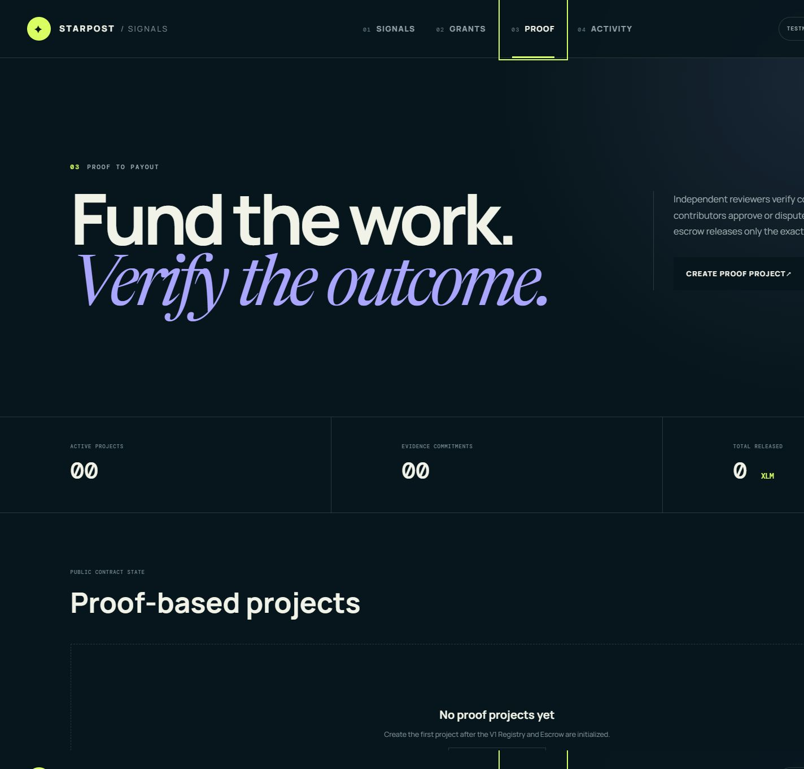
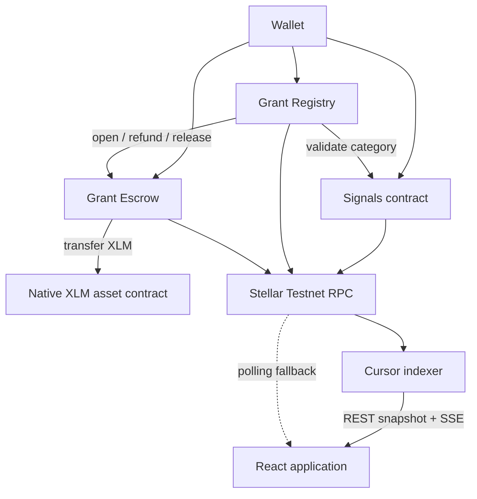

# Starpost Signals

**Signal what matters. Fund the work. Verify delivery on-chain.**

Starpost Signals is a production-style community coordination dApp on Stellar Testnet. The original permanent Signals poll remains live, and its four categories now lead into contributor-funded grants with escrowed XLM, milestone voting, releases, refunds, contract events, and real-time browser synchronization.

**Live app:** [starpost-signals.vercel.app](https://starpost-signals.vercel.app)

**Network:** Stellar Testnet

**Existing Signals contract:** [`CBHWJQ6Q4FAKCTC5IOS5YJDB2AOP5EF4SE6ODOLACCZZ2B3GV34J3YIP`](https://stellar.expert/explorer/testnet/contract/CBHWJQ6Q4FAKCTC5IOS5YJDB2AOP5EF4SE6ODOLACCZZ2B3GV34J3YIP)

**Level 3 Registry:** [`CCLUIBA3E7CILJOQYPYLV46W67U5HHR5PVQP4UEC6KTCYHWGZ5OFICHQ`](https://stellar.expert/explorer/testnet/contract/CCLUIBA3E7CILJOQYPYLV46W67U5HHR5PVQP4UEC6KTCYHWGZ5OFICHQ)

**Level 3 Escrow:** [`CADLWMML7RAV2INFHOYA3QNGELSORVXV7LORDBYMJJMLXTVZHGT5NRLK`](https://stellar.expert/explorer/testnet/contract/CADLWMML7RAV2INFHOYA3QNGELSORVXV7LORDBYMJJMLXTVZHGT5NRLK)

**Level 4 Impact Registry V1:** [`CBHNVYK2YL4FWYETEMN2HCAEYEMMJTL4MQWY4PODMMYFKTIJLNURG6T3`](https://stellar.expert/explorer/testnet/contract/CBHNVYK2YL4FWYETEMN2HCAEYEMMJTL4MQWY4PODMMYFKTIJLNURG6T3)

**Level 4 Impact Escrow V1:** [`CAB4Y37SZ3XUYG3OMGQQECXTE5IYQXXI23UFF2V4RBDV76AIHGMGK3PJ`](https://stellar.expert/explorer/testnet/contract/CAB4Y37SZ3XUYG3OMGQQECXTE5IYQXXI23UFF2V4RBDV76AIHGMGK3PJ)

## Level 5: Growth, guided onboarding, and ecosystem presentation

Level 5 adds a six-step onboarding journey, four role-specific paths, wallet/Testnet readiness, Friendbot funding, confirmed-transaction proof handoff, privacy-safe aggregate funnel events, and a verifier for the new 50-person campaign. It reuses the deployed Level 4 Registry and Escrow contracts; onboarding and analytics cannot authorize a financial state transition.

**Release status:** the implementation is complete on `codex/level5-growth`. The current live URL remains the Level 4 baseline until this branch passes review, is merged, and is deployed. Authentic recruitment, two feedback-driven releases, final analytics captures, and the recorded walkthrough intentionally remain open.

### Level 5 package

- [Development plan and delivery gates](docs/level5/DEVELOPMENT_PLAN.md)
- [User onboarding and 10 + 20 + 20 growth playbook](docs/level5/USER_ONBOARDING.md)
- [Google Form and private export specification](docs/level5/FORM_SPECIFICATION.md)
- [Privacy and public evidence policy](docs/level5/PRIVACY_AND_EVIDENCE.md)
- [Analytics and production indexer runbook](docs/level5/ANALYTICS_AND_OPERATIONS.md)
- [Feedback prioritization and iteration ledger](docs/level5/FEEDBACK_ITERATION.md)
- [Sanitized feedback workbook](docs/level5/evidence/starpost-level5-feedback-sanitized.xlsx) — empty public template with `Summary`, `Sanitized Responses`, and `Feedback Themes`; it contains no names, emails, or invented users
- [Editable 12-slide pitch deck](docs/level5/pitch/starpost-signals-level5-blue-belt.pptx) and [PDF companion](docs/level5/pitch/starpost-signals-level5-blue-belt.pdf)
- [6:45 narrated demo script and recording safeguards](docs/level5/DEMO_SCRIPT.md)
- [Final submission checklist](docs/level5/SUBMISSION_CHECKLIST.md)

The raw Google Sheet and Excel export must remain access-controlled because they connect name and email to public wallet activity. A restricted judge-verification URL will be added only after the project owner creates the authenticated Form/Sheet and confirms its sharing policy; it must never be replaced with a public raw export.

### Guided onboarding

The new **Start** view supports supporter/voter, contributor, project creator, and reviewer personas. It explains Testnet and public-wallet consent, checks wallet availability, unlock state, supported wallet, network, funding, and XLM balance, then routes the participant to an existing real action. Progress is stored under a versioned local-storage key without name or email and safely resets when corrupt or unsupported.

After RPC-confirmed success, the receipt preserves the wallet, action, transaction hash, and Stellar Expert link. `VITE_FEEDBACK_FORM_URL` opens the external Form; when it is absent, the receipt remains available and the interface displays a safe configuration message. The app never claims an external Form was submitted.

### Privacy-safe funnel

The indexer accepts only these Level 5 aggregate event names:

```text
onboarding_role_selected
onboarding_wallet_ready
onboarding_action_started
onboarding_action_confirmed
feedback_opened
```

Do Not Track disables the call. The service records only event name, release, count, and last-seen time—never wallet, hash, form answer, browser identifier, or free text. Telemetry and indexer failures cannot block a transaction.

### Verified cohort status

| Evidence | Level 4 baseline | New Level 5 cohort |
|---|---:|---:|
| Independent users | 10 | **0 / 50 — campaign pending** |
| Unique successful transactions | 10 | **0 / 50 — campaign pending** |
| Deeper lifecycle actions | existing demonstration lifecycle | **0 / 10 — campaign pending** |
| Seven-day repeat activity | not a Level 4 gate | **pending measurement** |
| Valid feedback-driven releases | not counted for Level 5 | **0 / 2 — authentic feedback pending** |

The ten Level 4 users are baseline evidence and do not count toward Level 5. A Level 5 participant qualifies only with a unique real person, private email, wallet, valid Form record, explicit consent, and at least one successful transaction against an approved Starpost contract.

Run the private verifier outside the public repository:

```text
npm run verify:level5 -- <private-raw.csv> <public-output-directory>
```

It rejects duplicate emails, wallets, and hashes; malformed records; missing consent; RPC/Horizon failures; unrelated contracts; missing action events; and actor/source mismatches. Its public JSON and sanitized CSV contain pass/fail reasons and Explorer links without names or emails.

### Feedback iteration record

The following pre-campaign work makes authentic feedback measurable; it does **not** count as either required Level 5 feedback release.

| Input or risk | Implemented preparation | Result | Commit |
|---|---|---|---|
| First-time users need role context | Four personas and a six-step guided journey | Each role reaches the existing real action without duplicated transaction logic | [`b47ec64`](https://github.com/EkinOnat/starpost-signals/commit/b47ec64) |
| New Testnet accounts may be unfunded | Readiness-aware Friendbot funding | A Horizon 404 becomes an actionable zero-balance state instead of a dead end | [`60be16f`](https://github.com/EkinOnat/starpost-signals/commit/60be16f) |
| Evidence must follow confirmed success | RPC-confirmed receipt and Form handoff | Wallet, action, hash, and Explorer proof remain copyable even without Form configuration | [`f8884d3`](https://github.com/EkinOnat/starpost-signals/commit/f8884d3) |
| Growth data must avoid wallet profiling | Aggregate allowlisted events | Funnel measurement respects Do Not Track and stores no personal or transaction properties | [`52349e7`](https://github.com/EkinOnat/starpost-signals/commit/52349e7) |
| Public evidence must exclude invalid users and PII | Private-input cohort verifier | Duplicate, failed, unrelated, actor-mismatched, or non-consented records fail deterministically | [`39046a8`](https://github.com/EkinOnat/starpost-signals/commit/39046a8) |
| Wave 1 authentic feedback | **Pending** | Add theme, before/after result, implementation, and direct commit after the 10-user gate | pending |
| Wave 2 authentic feedback | **Pending** | Add the second qualifying theme and direct commit after the 20-user gate | pending |

### Growth strategy and next roadmap

1. **Wave 1 — 10 users:** fix every transaction/security blocker and the most repeated usability problem.
2. **Wave 2 — 20 users:** compare funnel/rating changes and ship the next deterministic priority.
3. **Wave 3 — 20 users:** validate the final release, replace invalid records, and close at exactly 50 verified new participants.
4. Verify at least ten deeper actions and one complete creator/reviewer/contributor approval and payout lifecycle.
5. Measure distinct repeat transactions after seven days and publish the real result, including zero.
6. After the campaign, publish dated analytics/transaction screenshots, sanitized evidence, two feedback commits, public deck/video URLs, and the final requirement matrix.

### Level 5 requirement matrix

| Requirement | Current evidence | Status |
|---|---|---|
| Public repository and 20+ new meaningful commits | `codex/level5-growth` contains at least 24 cohesive Level 5 commits after `feec630` | Ready to push/review |
| Live application | Existing Level 4 Vercel deployment | Level 5 deployment pending merge |
| Guided onboarding and improved UX | Role guidance, readiness, resume/restart/back/dismiss, confirmation receipt, mobile styles, tests | Implemented |
| Production analytics and public indexer | Aggregate events and deployment runbook | Public service verification pending |
| Google Form and restricted raw source | Exact 19-field specification | Authenticated creation/share link pending owner sign-in |
| Sanitized Excel workbook | Repository workbook template | Implemented; authentic data pending |
| 50 new users and transactions | Verifier and three-wave playbook | 0/50; real recruitment required |
| Two feedback-driven improvements | Deterministic ledger and release gates | 0/2; authentic Wave 1/2 data required |
| Pitch deck / PPT | 12-slide `.pptx` and PDF with speaker-note sources | Implemented; public view URL pending |
| Demo video | Timed script and safety checklist | Authentic recording/public URL pending |
| Analytics and transaction screenshots | Evidence requirements documented | Final campaign captures pending |

Do not mark the monthly submission complete while any pending row remains. See the [Level 5 checklist](docs/level5/SUBMISSION_CHECKLIST.md) for the release owner’s final sign-off.

## Level 4: Proof-to-Payout

The additive Level 4 implementation extends the product to **Signal → Fund → Prove → Approve → Payout**. It includes versioned Impact Registry V1 and Impact Escrow V1 contracts, independent reviewer/arbitrator thresholds, content-addressed evidence, bounded contributor voting/disputes, exact milestone release, terminal refunds, a public mobile workflow, and a hash-verifying evidence/event service.

**Deployment status:** both V1 contracts are deployed and initialized on Stellar Testnet. Read-only smoke calls returned protocol version `1` and verified the Signals/Escrow wiring, independent guardian, running pause state, and immutable policy. Optimized WASM hashes are:

- Impact Registry V1: `0dc2a777489b37ed20051fd4cac107711387e0c3d90098766a4471f5777ce2e7`
- Impact Escrow V1: `6a6f5e77ecb6e80f67943e348112084249adf8f17a9803ba4f16f35fecbb627f`

Architecture, operations/TTL response, privacy, threat model, testing, onboarding, demo, and honest evidence status are in [`docs/level4`](docs/level4/ARCHITECTURE.md). The manual protected deployment workflow creates the final manifest; it does not publish secrets or invent transaction evidence.

Deployment and initialization transaction hashes are recorded in [`contract-deployment.json`](docs/level4/evidence/contract-deployment.json).


### Product, responsive, and operational evidence

The deployed Level 4 public view reads the initialized Registry and Escrow directly from Stellar Testnet. The 390px capture demonstrates the responsive product shell and its aggregate raised, active-grant, and released-milestone metrics.




Hosted deployment monitoring is public in the [successful main CI run](https://github.com/EkinOnat/starpost-signals/actions/runs/31851234105), covering Contracts, Frontend, Indexer, E2E, and Security jobs. The production deployment status is attached to the merged main commit by Vercel.

Ten consented independent users completed unique Freighter-signed Signals votes on Stellar Testnet. The reproducible [`user-interactions.csv`](docs/level4/evidence/user-interactions.csv) record and [`verification report`](docs/level4/evidence/user-interactions-verification.json) confirm 10 participants, 10 transactions, 10 passes, and 0 failures through RPC, Horizon, contract-event, source-account, and Explorer-link checks.

The preserved Signals and Level 3 instance/code TTLs were extended on 2026-08-15, and submitted getters refreshed the active grant, milestones, vault, known contribution/vote receipts, and documented Signal voter receipt. Transaction hashes and residual keeper scope are recorded in the [Level 4 operations guide](docs/level4/OPERATIONS.md).

## Product flow

1. **Signal** — connect Freighter, xBull, Albedo, or LOBSTR and cast one permanent category vote.
2. **Fund** — create or discover a category grant and contribute Testnet XLM into its Escrow vault.
3. **Prove** — a creator stores public content-addressed evidence and anchors its SHA-256 commitment.
4. **Approve** — independent reviewers attest, then capped contributor weight approves or disputes within bounded windows.
5. **Payout** — Escrow releases the exact authorized milestone or conserves the remaining pool for refunds.
6. **Verify** — raw versioned events, RPC-confirmed transaction states, and Stellar Expert links expose the lifecycle end to end.

## Level 1, 2, and 3 checklist

### Level 1

Level 1 was completed in the companion [StarPost payment dApp](https://github.com/EkinOnat/starpost-stellar-dapp), with its foundation evidence kept separate from this contract project.

- [x] React and TypeScript frontend
- [x] Freighter connection, disconnect, address, and native XLM balance
- [x] Stellar Testnet verification and Friendbot funding
- [x] Native XLM payment built with the Stellar SDK and signed through Freighter
- [x] Signing, submission, confirmation, failure feedback, and Explorer link
- [x] Missing wallet, wrong network, rejection, invalid input, insufficient balance, and network errors
- [x] Public repository and [live Level 1 demo](https://starpost-ekin.ekinonat10.chatgpt.site)
- [x] Verified payment [`c968c65f...1e33d2f`](https://stellar.expert/explorer/testnet/tx/c968c65f7b981f774223e221dac2652727bb8cd66d1ec33c6ae3aa8061e33d2f)

### Level 2

- [x] Four-wallet StellarWalletsKit picker
- [x] Deployed Signals contract with read/write calls
- [x] One permanent vote per account
- [x] `VoteCast` activity synchronization
- [x] Wallet, network, balance, duplicate-vote, rejection, and RPC errors
- [x] Confirmed transaction state and Explorer proof
- [x] Public deployment, setup instructions, screenshots, and meaningful commit history

### Level 3 implementation

- [x] Additive Registry and Escrow contracts; original Signals contract untouched
- [x] Registry-to-Signals and Registry-to-Escrow calls
- [x] Escrow-to-native-XLM asset transfers
- [x] Exact-goal funding, weighted voting, milestone release, cancellation, and refunds
- [x] Responsive Signals, Grants, and Activity views
- [x] Shared `validating -> simulating -> awaiting_signature -> submitted -> pending -> confirmed/failed/timed_out` lifecycle
- [x] Persistent cursor indexer, event deduplication, snapshots, SSE, retry, and RPC fallback
- [x] 60 Rust contract tests, 19 frontend tests, 14 indexer tests, and 4 E2E flows
- [x] Independent CI jobs, protected deployment workflow, release artifacts, and Dependabot
- [x] Threat model, operations guide, deployment manifest, and reproducible WASM hashes
- [x] Registry and Escrow Testnet deployment and nested-call proof hash
- [x] Production frontend redeployment and final mobile screenshot
- [ ] Public indexer deployment
- [ ] Green hosted CI screenshot
- [x] Public Level 3 demo video

Items that need deployed credentials or hosted-service access stay unchecked until their public evidence exists.

## Requirement matrix

| Requirement | Implementation |
| --- | --- |
| Preserve live Level 2 poll | Existing contract ID and Signals read/write path remain unchanged |
| Signals categories drive grants | Registry reads `get_results` and validates the category index |
| Two to five exact milestones | Registry rejects non-positive amounts and totals unequal to the goal |
| Escrowed XLM | Escrow calls the Testnet native XLM Stellar Asset Contract |
| Exact funding cap | Contributions fail when the new total would exceed the goal |
| Funding finalization | Exact goal activates; an underfunded expired round fails and becomes refundable |
| Weighted contributor voting | Escrow contribution balance is the Registry voting weight |
| Approval and quorum | Checked basis-point calculations guard every milestone release |
| Refunds | Failed/cancelled grants enable one claim per contributor |
| Real-time activity | Persistent indexer snapshots plus SSE, heartbeat, dedupe, retry, and direct RPC fallback |
| Transaction correctness | Success appears only after RPC reports `SUCCESS`; hash persists through timeout/failure |
| Mobile/accessibility | 320/390/768/desktop layouts, 44px targets, labels, focus states, reduced motion |
| Production safeguards | Validated configuration, CORS allowlist, rate limit, headers, structured logs, graceful shutdown |

## Architecture



Detailed design: [Level 3 architecture](docs/LEVEL3_ARCHITECTURE.md) · [Threat model](docs/THREAT_MODEL.md) · [Operations](docs/OPERATIONS.md)

## Contracts

### Signals (preserved Level 2)

- `initialize(admin, question, options)`
- `vote(voter, option)`
- `get_results()`
- `get_vote(voter)`

### Grant Registry

- `initialize(admin, signals, escrow)`
- `create_grant(creator, category, title, asset, goal, deadline, milestones, approval_bps, quorum_bps)`
- `finalize_funding(grant_id)`
- `vote_milestone(grant_id, voter, approve)`
- `finalize_milestone(grant_id)`
- `cancel_grant(grant_id)`
- `set_paused(paused)`
- `get_grant(grant_id)`, `get_milestones(grant_id)`, `has_voted(...)`

### Grant Escrow

- `initialize(admin, registry)`
- `open_grant(grant_id, creator, asset, goal, deadline)`
- `contribute(grant_id, contributor, amount)`
- `release(grant_id, milestone, amount)`
- `set_refundable(grant_id)`
- `claim_refund(grant_id, contributor)`
- `set_paused(paused)`
- `get_vault(grant_id)`, `total(grant_id)`, `contribution(...)`

### Events

`VoteCast`, `GrantCreated`, `VaultOpened`, `ContributionMade`, `FundingFinalized`, `MilestoneVoteCast`, `MilestoneApproved`, `FundsReleased`, `RefundEnabled`, `RefundClaimed`, and `GrantCancelled` feed the unified activity model.

## Reproducible artifacts

| Contract | Optimized WASM SHA-256 |
| --- | --- |
| Registry | `eac1ff7e0fb4201f070f0a90b64ef40dfec8dc403cae26b30555a883b5971c81` |
| Escrow | `e83be6d9f39addda57fb187f62a239f8acdb2f2e3e48cc862722e567a6674aa1` |

Addresses, artifact hashes, and every proof transaction live in [`deployments/testnet.json`](deployments/testnet.json).

## Transaction and error behavior

All Signals and Grants mutations use one state machine:

```text
idle -> validating -> simulating -> awaiting_signature
     -> submitted -> pending -> confirmed
                             |-> failed
                             `-> timed_out
```

The UI handles wallet availability/lock/rejection, wrong network, insufficient spendable XLM, RPC/simulation/submission errors, pending timeouts, invalid schedules/deadlines, funding state, goal cap, no voting power, duplicate votes, quorum/approval failures, unavailable/duplicate refunds, and paused contracts. A pending timeout is neutral and keeps its Explorer link.

## Event service

The TypeScript service exposes:

- `GET /health`
- `GET /ready`
- `GET /api/v1/events?limit=200`
- `GET /api/v1/grants`
- `GET /api/v1/contract-events`
- `GET /api/v1/stream` and `/api/v1/contract-stream` (resumable Server-Sent Events)
- content-addressed `/api/v1/metadata/*` and `/api/v1/evidence/*`

It persists the event cursor and materialized state to `INDEXER_DATA_FILE` with atomic replacement and backup recovery, retains a versioned raw contract-event stream, reports ledger lag, retries RPC with bounded exponential delay, sends heartbeats, and emits structured JSON logs. Evidence and index data share the mounted persistent disk defined by `render.yaml` and `Dockerfile.indexer`.

## Local setup

### Prerequisites

- Node.js 22
- npm
- A supported wallet configured for Stellar Testnet
- Rust and Stellar CLI for contract work

```bash
git clone https://github.com/EkinOnat/starpost-signals.git
cd starpost-signals
npm ci --ignore-scripts
cp .env.example .env
npm run dev
```

Run the indexer in a second terminal:

```bash
cp indexer/.env.example indexer/.env
npm run indexer
```

## Environment variables

### Frontend

| Variable | Purpose |
| --- | --- |
| `VITE_CONTRACT_ID` | Existing Signals address |
| `VITE_REGISTRY_CONTRACT_ID` | Level 3 Registry address |
| `VITE_ESCROW_CONTRACT_ID` | Level 3 Escrow address |
| `VITE_NATIVE_ASSET_CONTRACT_ID` | Testnet native XLM asset contract |
| `VITE_STELLAR_RPC_URL` | Stellar RPC endpoint |
| `VITE_HORIZON_URL` | Horizon balance endpoint |
| `VITE_INDEXER_URL` | Public indexer origin |
| `VITE_IMPACT_REGISTRY_CONTRACT_ID` | Level 4 Impact Registry V1 address; empty before deployment |
| `VITE_IMPACT_ESCROW_CONTRACT_ID` | Level 4 Impact Escrow V1 address; empty before deployment |
| `VITE_EVIDENCE_API_URL` | Hash-verifying evidence service origin |
| `VITE_APP_RELEASE` | Public immutable release identifier |
| `VITE_MAX_GRANT_ID` | Upper bound for the fallback discovery probe (default 100, hard cap 2000) |
| `VITE_GRANT_DISCOVERY_CONCURRENCY` | Parallel grant reads per batch (default 4, hard cap 16) |
| `VITE_GRANT_READ_TIMEOUT_MS` | Per-request contract read timeout (default 15000) |
| `VITE_TEST_GRANT_IDS` | Comma-separated grant IDs explicitly classified as test records and hidden from public totals by default |

If Registry/Escrow IDs are absent, the Grants discovery view clearly enters preview mode and financial wallet actions explain that deployment is pending. The live Signals poll still works.

### Grant discovery

Grants are discovered from persisted Registry state, not from recent events. RPC serves only a short event window, so a `GrantCreated` event older than that window used to make a funded grant invisible; contract reads have no such expiry.

1. The client reads the Registry's `NextGrantId` allocator directly from contract instance storage — the deployed Registry exposes no count or next-id getter, so this ledger entry is the exact enumeration bound.
2. If that entry cannot be read, discovery falls back to a bounded probe of `1..VITE_MAX_GRANT_ID` in parallel batches. A missing id never stops the scan, so a gap cannot hide a later valid grant.
3. Ids seen through events or the indexer are unioned in and de-duplicated, so discovery is always a superset of the event pipeline.
4. `GrantNotFound` from the contract means the id does not exist; anything else is a transport failure and is reported as a retryable error rather than an empty dashboard.
5. Each view records the ledger it was read at, so events already reflected in stored state are shown in the activity feed but never re-applied to contribution totals or vote weights.

The indexer and the event stream enrich activity only. They are never required to discover a grant, and a stale indexer value is always overridden by a direct contract read.

### Indexer

`PORT`, `STELLAR_RPC_URL`, all configured contract IDs, `INDEXER_DATA_FILE`, `EVIDENCE_DATA_DIR`, size/lag limits, `POLL_INTERVAL_MS`, `CORS_ORIGINS`, and `RATE_LIMIT_PER_MINUTE` are validated on startup.

## Quality gates

```bash
cargo fmt --all -- --check
cargo clippy --workspace --all-targets -- -D warnings
cargo test --workspace
stellar contract build
npm run typecheck
npm test
npm run build
npm run build:indexer
npm run test:e2e
```

Current local coverage:

- 60 Rust tests (preserved Level 1–3 plus 20 focused V1 tests)
- 19 frontend Vitest/Testing Library tests
- 14 indexer/evidence tests
- 3 Playwright mobile Chromium flows at 390x844

## CI/CD

`.github/workflows/ci.yml` runs independent Contracts, Frontend, Indexer, E2E, and Security jobs. The manual Testnet workflow requires the protected `testnet` GitHub Environment and `TESTNET_DEPLOYER_SECRET`, builds from a clean checkout, runs tests, deploys/initializes both contracts, performs a smoke call, records hashes, and uploads a deployment manifest without printing the secret. Release tags attach optimized WASM and checksums.

Merging `main` continues to deploy the existing Vercel project. The Render blueprint deploys the event service only after its environment contains the final Registry and Escrow IDs.

## Existing Testnet proof

- Signals deploy: [`facdbc788ee9d4d5e035df76641b15355613e2e9c82b74327186ba54898440c5`](https://stellar.expert/explorer/testnet/tx/facdbc788ee9d4d5e035df76641b15355613e2e9c82b74327186ba54898440c5)
- Signals initialization: [`6cd54416243f0cfd8afaadc261390bf1c5b0fd77af02b833aa8822adc42eff00`](https://stellar.expert/explorer/testnet/tx/6cd54416243f0cfd8afaadc261390bf1c5b0fd77af02b833aa8822adc42eff00)
- Verified `VoteCast`: [`b48752993b42bee828c55b8d8c4720f4e8b5ee62ee08083bcc2151ffffb259c3`](https://stellar.expert/explorer/testnet/tx/b48752993b42bee828c55b8d8c4720f4e8b5ee62ee08083bcc2151ffffb259c3)

## Level 3 Testnet proof

- Registry deployment: [`9c13dffe4f868650af1ef1c164bb5a7d6d332a03474a50c9fb608d7ae06bebe9`](https://stellar.expert/explorer/testnet/tx/9c13dffe4f868650af1ef1c164bb5a7d6d332a03474a50c9fb608d7ae06bebe9)
- Escrow deployment: [`df42e3c4e34bc5677c1a472b2e03ba462a99a4bd37a336df62d3c290da276d4c`](https://stellar.expert/explorer/testnet/tx/df42e3c4e34bc5677c1a472b2e03ba462a99a4bd37a336df62d3c290da276d4c)
- Registry initialization: [`c8ed33236ee1e62b274b92c2a87748bb71907e2f63a9775c04f9e325579f9882`](https://stellar.expert/explorer/testnet/tx/c8ed33236ee1e62b274b92c2a87748bb71907e2f63a9775c04f9e325579f9882)
- Composed grant creation (Signals validation + Escrow vault): [`1fd1b361fe850e16e30f59ac7d24a68bac895d05690703ac5ce2bc953c7aeeda`](https://stellar.expert/explorer/testnet/tx/1fd1b361fe850e16e30f59ac7d24a68bac895d05690703ac5ce2bc953c7aeeda)
- Native XLM contribution: [`6a914ce0a7760f8a681727af6af8a55beebde601d61fac23821418fc15f01e6e`](https://stellar.expert/explorer/testnet/tx/6a914ce0a7760f8a681727af6af8a55beebde601d61fac23821418fc15f01e6e)
- Weighted milestone vote: [`78574ff884785cdba0b6c974b6b913670ed27293bc7e3f938ab22bec07cd3258`](https://stellar.expert/explorer/testnet/tx/78574ff884785cdba0b6c974b6b913670ed27293bc7e3f938ab22bec07cd3258)
- **Nested Registry -> Escrow -> native XLM release:** [`891832eefe0bf51d49f1278fa84cb7ea66b986118f173d96b505031fc290efac`](https://stellar.expert/explorer/testnet/tx/891832eefe0bf51d49f1278fa84cb7ea66b986118f173d96b505031fc290efac)

The demonstration grant is active with 100 XLM deposited and milestone 1 released for 40 XLM. The final proof transaction contains the native asset `transfer`, Escrow `funds_released`, and Registry `milestone_approved` events in one invocation.


## Security and limitations

This is Testnet software: do not send real XLM. No secret key is committed, bundled, or passed to the browser. The contracts have extensive automated invariant coverage but no independent audit. The indexer is not trusted for financial state transitions; Stellar contracts remain the source of truth. See the [threat model](docs/THREAT_MODEL.md) for the full control and residual-risk list.

## Level 3 demo video

Watch the [silent Starpost Signals Level 3 demo on YouTube](https://youtu.be/Frz0deHSgyU). It demonstrates the preserved Signals poll, milestone-based grant creation, the wallet-signed transaction lifecycle, Registry and Escrow events, and successful Stellar Testnet Explorer proof.
