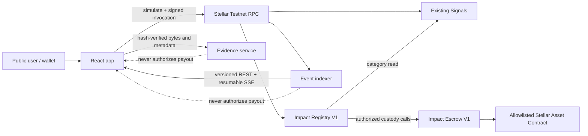

# Level 4 architecture

## Status

Impact Registry V1, Impact Escrow V1, the public proof workflow, content-addressed evidence API, raw contract-event index, and protected deployment workflow are implemented. The V1 contracts are not represented as deployed until `docs/level4/evidence/contract-deployment.json` contains owner-verified addresses and transactions.

The permanent Signals contract and both Level 3 contracts remain unchanged.

## Trust boundaries

Registry contains attestation and dispute modules so a decision and its state transition are atomic. Splitting those rules into more contracts would add nested authorization, deployment, TTL, and upgrade boundaries without reducing custody risk. Escrow remains separate because custody deserves a small, independently testable allowlist and accounting boundary.

## Financial authority

- Wallet authorization proves the actor.
- Registry V1 validates roles, immutable project policy, stage, deadline, receipts, reviewer threshold, quorum, approval, dispute, and arbitration.
- Escrow V1 validates allowlisted asset policy, exact schedule, contribution cap, ordered one-time releases, and conservative refunds.
- Stellar RPC and contract storage are authoritative. The frontend, evidence service, and indexer are not payout authorities.

## Project lifecycle

`Draft -> Funding -> Funded -> Active -> Completed`

Terminal and exception branches are `Failed`, `Cancelled`, and `Disputed`. Failed and cancelled paths enable refunds. Disputed returns to Active after release approval or rework, or becomes Failed after rejection/timeout.

## Milestone lifecycle

`Pending -> EvidenceSubmitted -> UnderReview -> Verified -> Voting -> Approved -> Released`

Reviewer rejection enters `Rejected`, with one bounded rework when the immutable policy allows two attempts. Contributor dispute enters `Disputed` and requires the arbitrator threshold or timeout. Every stage has a bounded deadline; permissionless finalizers cannot approve before its configured window closes.

## Evidence

Project, milestone, and evidence metadata use canonical JSON SHA-256. Evidence bytes are hashed in the browser, uploaded under a short-lived reservation, verified again by the service, and served by immutable content hash as a sandboxed attachment. Only 32-byte content and metadata hashes plus attempt number are stored on-chain.

The service accepts PDF, JPEG, PNG, WebP, plain text, CSV, and JSON up to 20 MiB by default. The UI warns against personal information, KYC data, identity documents, secrets, and malicious files.

## Availability and persistence

The indexer keeps an RPC cursor, a materialized Level 3 grant snapshot, up to 20,000 versioned raw events, and up to 100,000 deduplication IDs. State writes use a same-directory temporary file, atomic rename, and last-valid backup. `/health` is liveness; `/ready` returns 503 until the poller succeeds and its ledger lag is within policy.

Evidence and index data require a mounted persistent disk. Production backup must snapshot the disk and verify restoration. Content hashes allow integrity verification after recovery.

## Configuration

Frontend:

- `VITE_IMPACT_REGISTRY_CONTRACT_ID`
- `VITE_IMPACT_ESCROW_CONTRACT_ID`
- `VITE_EVIDENCE_API_URL`
- `VITE_INDEXER_URL`
- `VITE_APP_RELEASE`

Service:

- `IMPACT_REGISTRY_CONTRACT_ID`, `IMPACT_ESCROW_CONTRACT_ID`
- `INDEXER_DATA_FILE`, `INDEXER_START_LEDGER`, `MAX_READY_LAG_LEDGERS`
- `EVIDENCE_DATA_DIR`, `EVIDENCE_MAX_BYTES`
- `CORS_ORIGINS`, `RATE_LIMIT_PER_MINUTE`, `APP_RELEASE`

Empty V1 contract IDs are an explicit not-deployed state: the interface remains public, shows no fabricated project data, and disables V1 mutations.

## Reproducible V1 artifacts

Built with Stellar CLI 27.1.0 and the locked Rust workspace:

| Artifact | Optimized SHA-256 |
| --- | --- |
| `impact_registry_v1.wasm` | `0dc2a777489b37ed20051fd4cac107711387e0c3d90098766a4471f5777ce2e7` |
| `impact_escrow_v1.wasm` | `6a6f5e77ecb6e80f67943e348112084249adf8f17a9803ba4f16f35fecbb627f` |

These hashes are local build evidence, not deployment evidence.
